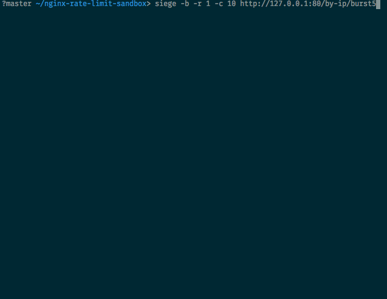

# NGINX Rate Limit, Burst and nodelay sandbox

NGINX Rate limiting is more traffic-shaping than pure rate-limiting. And this is an important point to understand how it works with the `burst` and `no_delay` settings.

Tools: Docker, and [Siege](https://www.joedog.org/siege-home/) (you can brew-it, or use other cli load-testing tools like ab or artillery or anything you like!)

The Nginx config defines a few locations to test the various combinations of:
- limit_req_zone by uri or by ip
- using the burst argument (set to 5 in this case) or not
- adding nodelay to control how to deal with request going over-quota during bursts.

The rates defined are:
- 30 req/min
- burst locations allow a burst of 5

With the leaky bucket, that means a new request should be allowed ever 2 seconds.

The endpoints defined are:
- http://127.0.0.1:80/by-uri/burst0
- http://127.0.0.1:80/by-uri/burst0_nodelay
- http://127.0.0.1:80/by-uri/burst5
- http://127.0.0.1:80/by-uri/burst5_nodelay
- http://127.0.0.1:80/by-ip/burst0
- http://127.0.0.1:80/by-ip/burst0_nodelay
- http://127.0.0.1:80/by-ip/burst5
- http://127.0.0.1:80/by-ip/burst5_nodelay

## Test it!

Run the Nginx in a docker container:

Choose one of:

    # If you want to see NGINX logs
    docker run -it --rm -p 80:80 sportebois/nginx-rate-limit-sandbox
    # If you want to run it in the background
    NGINX_CONTAINER_ID=$(docker run -d --rm -p 80:80 sportebois/nginx-rate-limit-sandbox)
    # Then when you want to stop and clean it:
    docker stop $NGINX_CONTAINER_ID

Using Siege to send 10 concurrent requests at once on the various endpoints
The most interesting ones are the burst5 and burst5_nodelay which let you really visualize and remember how nginx deal with burst settings!

    siege -b -r 1 -c 10 http://127.0.0.1:80/by-uri/burst0
    siege -b -r 1 -c 10 http://127.0.0.1:80/by-uri/burst0_nodelay
    siege -b -r 1 -c 10 http://127.0.0.1:80/by-uri/burst5
    siege -b -r 1 -c 10 http://127.0.0.1:80/by-uri/burst5_nodelay

    siege -b -r 1 -c 10 http://127.0.0.1:80/by-ip/burst0
    siege -b -r 1 -c 10 http://127.0.0.1:80/by-ip/burst0_nodelay
    siege -b -r 1 -c 10 http://127.0.0.1:80/by-ip/burst5
    siege -b -r 1 -c 10 http://127.0.0.1:80/by-ip/burst5_nodelay

When doing these tests, you will want to pay attention to:
- the success/status code (obviously)
- the response time it took, both for the rate-limited requests _and_ the succesfull requests

You should see something like this, then you'll be able to play with all the other various locations/settings: 